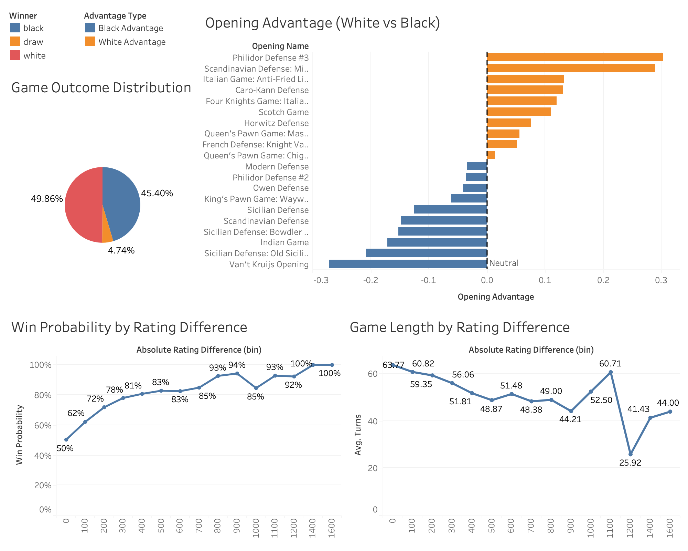

# ♟️ Chess Game Strategy & Skill Analysis

An exploratory data analysis and visualization project examining how **player skill differences and opening strategies influence chess game outcomes**.  
Using game data from Lichess, this project analyzes win probability, opening advantage, and game dynamics through an interactive Tableau dashboard.

---

## 📊 Project Overview

Chess outcomes depend heavily on **player skill, opening strategy, and game dynamics**.  
This project investigates how these factors interact by analyzing thousands of online chess games and visualizing patterns in:

- Win probability relative to **rating difference**
- Strategic advantages of **different openings**
- Distribution of **game outcomes**
- Relationship between **skill difference and game length**

The analysis is presented through an interactive **Tableau dashboard** designed to highlight key insights for players and analysts.

---

## 🗂 Dataset

The dataset contains **20,000+ chess games** from Lichess, including information such as:

- Player ratings
- Game outcomes (white win, black win, draw)
- Opening names
- Number of moves (turns)
- Winner of each match

Derived fields were created to support analysis, including:

- **Rating Difference** – difference between player ratings  
- **Absolute Rating Difference** – magnitude of skill gap between players  
- **Opening Advantage** – difference between white and black win rates  
- **Win Probability** – probability that the higher-rated player wins  

---

## 📈 Dashboard Insights

The analysis produced several key insights about chess gameplay dynamics.

### 1️⃣ Skill Difference Strongly Predicts Game Outcomes

Win probability increases sharply as the rating gap grows.

- When ratings are equal → win probability ≈ **50%**
- A **200-point rating advantage** leads to ~**72% win probability**
- A **500+ rating gap** results in **80–90% win probability**

This reflects the well-known **Elo rating system**, where even moderate rating differences significantly affect expected outcomes.

---

### 2️⃣ Evenly Matched Players Produce Longer Games

Game length tends to decrease as skill differences increase.

- Equal-skill games average **~60 moves**
- Large rating gaps often result in **shorter games**
- Stronger players are able to convert advantages faster

This suggests competitive matches lead to **longer and more strategic play**.

---

### 3️⃣ Certain Openings Provide Structural Advantage

By comparing **white and black win rates**, openings were evaluated using:
Opening Advantage = White Win Rate − Black Win Rate

Findings show:

- Some openings show a **clear advantage for White**
- Others perform **better for Black**
- Several openings remain **strategically balanced**

This helps identify openings that historically provide stronger winning chances for each side.

---

### 4️⃣ Overall Game Outcome Distribution

Across all analyzed games:

- **White wins:** ~49.9%
- **Black wins:** ~45.4%
- **Draws:** ~4.7%

White maintains a slight overall advantage due to **first-move initiative**, though the difference is relatively small.

---

## 📊 Dashboard Preview

The Tableau dashboard integrates these analyses into a single view.

The dashboard highlights relationships between **skill gaps, strategy, and match outcomes** in a clear and interpretable format.

---

## 🛠 Tools Used

- **Tableau** – Data visualization and dashboard development  
- **SQL / Data preprocessing** – Data cleaning and aggregation  
- **Python (Pandas, NumPy)** – Data exploration and transformation  
- **GitHub** – Project documentation and version control  

---

## 🎯 Key Takeaways

- Rating difference is the **strongest predictor of game outcome**
- Closely matched players produce **longer and more strategic games**
- Some chess openings show **consistent advantage patterns**
- Data-driven analysis can reveal **strategic insights in competitive games**

---

## 🚀 Future Improvements

Potential extensions of this project include:

- Player rating distribution analysis
- Time control effects (blitz vs rapid)
- Opening popularity vs effectiveness
- Machine learning models to predict game outcomes

---

### 👤 Author

**Adivi Karawat**  
Data Analytics | Business Intelligence | Strategy Analytics
